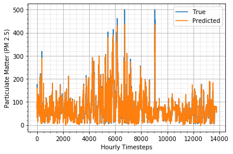

# Forecasting-Air-Quality-Index
## Forecasting Particulate Matter Concentration with LSTM

## Introduction
Particulate matter is a significant contributor to air pollution and climate change, with serious health implications for humans and negative effects on agriculture and the economy. In this project, we explore the use of deep learning models, specifically Long Short-Term Memory (LSTM) networks, to forecast the concentration of particulate matter in two highly polluted regions: Beijing, China and Punjab, Pakistan.

 Scale, EPA USA")

## Dataset
We assessed the performance of our network using two datasets from highly polluted regions in South Asia. 

### Beijing, China Dataset
The first dataset pertains to the Beijing region in China and is publicly available on the UCI website (Beijing Data) (Liang et al., 2015), with additional modifications made by (Reddy et al., 2017). The enhanced Beijing air quality dataset includes pollutant data, such as PM2.5 concentration, as well as meteorological parameters like dew point, temperature, pressure, cumulative hours of snow, combined wind direction, cumulative wind speed, and cumulative hours of rain. The dataset spans 35 different stations across Beijing and covers a period of 7 years from 2010 to 2017, comprising a total of 43,825 samples.

### Punjab, Pakistan Dataset
The second dataset covers some regions across Punjab with 4 stations across Lahore, which is one of the most polluted cities in the world, and one station each in Multan and Gujranwala respectively. The dataset comprises meteorological parameters acquired from the Pakistan Meteorological Department and pollutant concentration obtained from the Environment Projection Department, Punjab.

## Model Architecture
We employed a recurrent neural network (RNN) with LSTM units for time series forecasting. The LSTM model is known for its ability to capture long-term dependencies in sequential data, making it suitable for time series forecasting tasks. We used Bayesian optimization to tune the hyperparameters of the LSTM model and optimize weight initialization strategies based on the dataset.

## Results
### For Beijing dataset:
  - Next hour forecast RMSE: 0.1913 (91.5% accuracy)
  - Next 24 hours forecast RMSE: 0.7290
    

### For Punjab dataset:
  - Next day forecast RMSE: 0.2192
    

## Conclusion
The LSTM model shows promising results in forecasting particulate matter concentration, with potential applications in establishing early warning systems based on the air quality index (AQI). These forecasts could enable governments to enact policies aimed at improving air quality and mitigating the health and economic impacts of air pollution.

## Code
The code for the LSTM model and data preprocessing can be found in this repositery.

## References
- Gul S., Khan G.M, Yousaf S. (2022). Multi-step short-term
PM 2.5 forecasting for enactment of proactive
environmental regulation strategies. Environmental Monitoring
and Assessment. 194, 386.(https://doi.org/10.1007/s10661-022-10029-4)

- Gul S., Khan G.M. (2020) Forecasting Hazard Level of Air Pollutants
Using LSTM’s. In: Maglogiannis I., Iliadis L., Pimenidis E. (eds) Artificial
Intelligence Applications and Innovations. AIAI 2020. IFIP Advances
in Information and Communication Technology, vol 584. Springer,
Cham. https://doi.org/10.1007/978-3-030-49186-4_13

- Liang, X., Zou, T., Guo, B., Li, S., Zhang, H., Zhang, S., Huang, H., & Chen S. X. (2015). Assessing Beijing’s pm2.5 pollution: severity, weather impact, APEC and winter heating. Proceedings of the Royal Society A: Mathematical, Physical and Engineering Sciences, 471(2182). https://doi.org/10.1098/rspa.2015.0257
Intelligence Applications and Innovations. AIAI 2020. IFIP Advances
in Information and Communication Technology, vol 584. Springer,
Cham. https://doi.org/10.1007/978-3-030-49186-4_13

- Reddy, V., Yedavalli, P., Mohanty, S., & Nakhat, U. (2017). Deep air: forecasting air pollution in Beijing, China. Environmental Science

